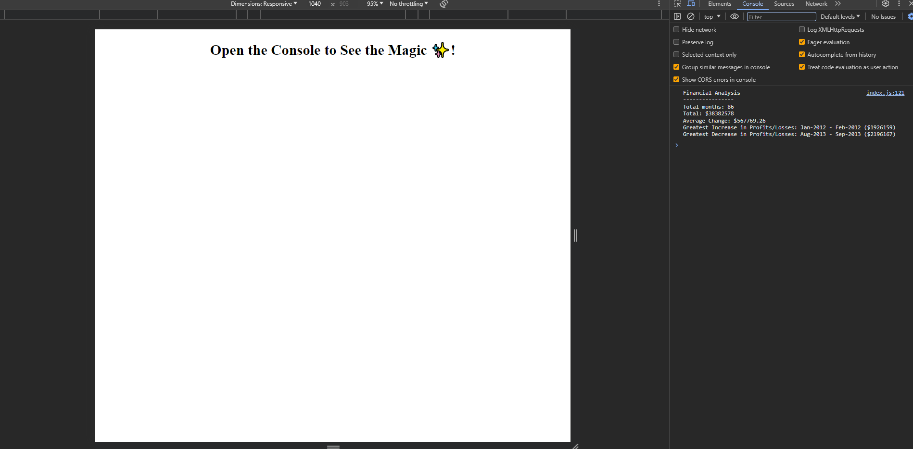

# Console Finance Analysis Tool

A simple web-page that uses Javascript to analyse an array of financial records.

## Description

This project is a simple financial tool that analyses a fixed array of financial data and prints the analysis to the browser console. The application was built using HTML and Javascript.

Reporting features include:
* Total months in array
* Net profit / losses
* Average of changes in profit / losses
* Greatest increase in profit month-to-month
* Greatest decrease in profit month-to-month

## Links

[Link to the deployed site](https://uberponky.github.io/Console-Finances/)

[Link to the GitHub repository](https://github.com/uberponky/Console-Finances)

## Installation

Access the deployed website via the links above. You can also clone the repository via Github and deploy locally to view the site.

## Usage

Once accessed / deployed, access the browser console to see the analysis.

## Credits

N/A

## Contributing

N/A

## License

MIT License

Copyright (c) 2023 Rory Simmonds

Permission is hereby granted, free of charge, to any person obtaining a copy
of this software and associated documentation files (the "Software"), to deal
in the Software without restriction, including without limitation the rights
to use, copy, modify, merge, publish, distribute, sublicense, and/or sell
copies of the Software, and to permit persons to whom the Software is
furnished to do so, subject to the following conditions:

The above copyright notice and this permission notice shall be included in all
copies or substantial portions of the Software.

THE SOFTWARE IS PROVIDED "AS IS", WITHOUT WARRANTY OF ANY KIND, EXPRESS OR
IMPLIED, INCLUDING BUT NOT LIMITED TO THE WARRANTIES OF MERCHANTABILITY,
FITNESS FOR A PARTICULAR PURPOSE AND NONINFRINGEMENT. IN NO EVENT SHALL THE
AUTHORS OR COPYRIGHT HOLDERS BE LIABLE FOR ANY CLAIM, DAMAGES OR OTHER
LIABILITY, WHETHER IN AN ACTION OF CONTRACT, TORT OR OTHERWISE, ARISING FROM,
OUT OF OR IN CONNECTION WITH THE SOFTWARE OR THE USE OR OTHER DEALINGS IN THE
SOFTWARE.